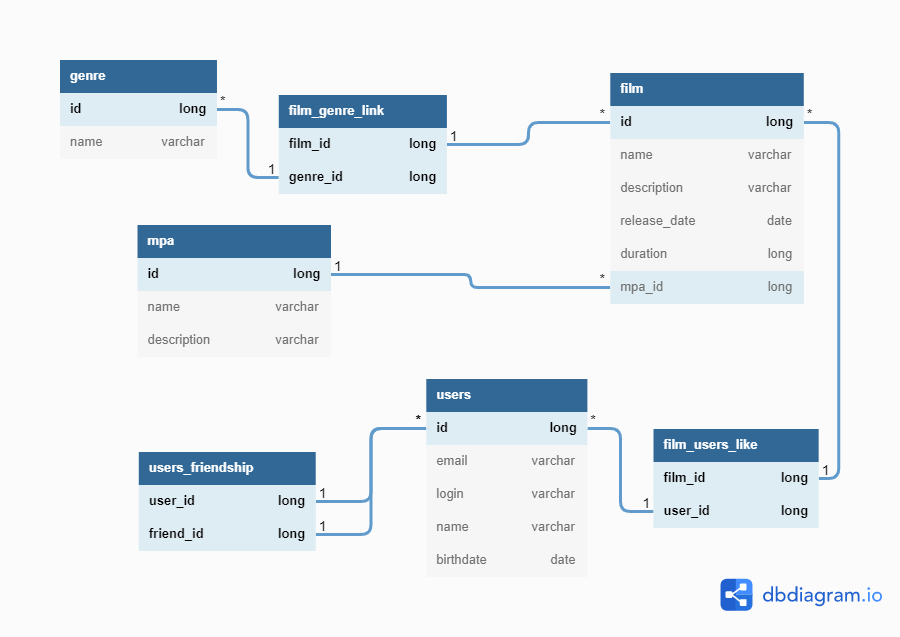

# Проект Java-Filmorate

## Схема
Предполагаемая схема базы данных представлена на картинке ниже


## Создание таблиц
### users
```sql
CREATE TABLE users (
    id        bigserial primary key,
    email     varchar,
    login     varchar,
    name      varchar,
    birthdate date
);
```
### users_friendship
```sql
CREATE TABLE users_friendship (
    user_id        bigint,
    friend_id bigint,
    primary key (user_id, friend_id)
);
```
### film
```sql
CREATE TABLE film (
    id bigserial primary key,
    name varchar,
    description varchar,
    release_date date,
    duration bigint,
    mpa_id bigint
);
```
### film_users_like
```sql
CREATE TABLE film_users_like (
    film_id bigint,
    user_id bigint,
    primary key (film_id, user_id)
);
```
### genre
```sql
CREATE TABLE genre (
    id bigserial primary key,
    name varchar
);
```
### mpa
```sql
CREATE TABLE mpa (
    id bigserial primary key,
    name varchar,
    description varchar
);
```
### film_genre_link
```sql
CREATE TABLE film_genre_link (
    film_id bigint,
    genre_id bigint,
    primary key (film_id, genre_id)
);
```
## Зависимости
```sql
ALTER TABLE users_friendship ADD CONSTRAINT fk_users_friendship_user FOREIGN KEY (user_id) REFERENCES users(id);
ALTER TABLE users_friendship ADD CONSTRAINT fk_users_friendship_friend FOREIGN KEY (friend_id) REFERENCES users(id);

ALTER TABLE film_users_like ADD CONSTRAINT fk_film_users_like_film FOREIGN KEY (film_id) REFERENCES film(id);
ALTER TABLE film_users_like ADD CONSTRAINT fk_film_users_like_user FOREIGN KEY (user_id) REFERENCES users(id);

ALTER TABLE film_genre_link ADD CONSTRAINT fk_film_genre_link_film FOREIGN KEY (film_id) REFERENCES film(id);
ALTER TABLE film_genre_link ADD CONSTRAINT fk_film_genre_link_genre FOREIGN KEY (genre_id) REFERENCES genre(id);

ALTER TABLE film ADD CONSTRAINT fk_film_mpa FOREIGN KEY (mpa_id) REFERENCES mpa(id);
```
## Индексы
```sql
CREATE INDEX idx_film_mpa_id ON film (mpa_id);
-- Возможно понадобятся и другие индексы
```
## Примеры важных запросов
### Статус дружбы
#### Пояснение
Как видим у меня нет отдельного поля под статус дружбы, а сам статус определяется следующим образом:

| user_id | friend_id | Комментарий                                                                                                          |
|---------|-----------|----------------------------------------------------------------------------------------------------------------------|
| 1       | 2         | У пользователя 1 отправлена заявка на дружбу с пользователем 2. У пользователя 2 эта заявка отображается во входящих |
|         |           |                                                                                                                      |
| 2       | 1         | У пользователя 2 отправлена заявка на дружбу с пользователем 1. У пользователя 1 эта заявка отображается во входящих |
|         |           |                                                                                                                      |
| 1       | 2         |                                                                                                                      |
| 2       | 1         | дружба между пользователями 1 и 2 подтверждена                                                                       |

#### Запросы
```sql
-- взаимные друзья пользователя 1
select u.friend_id from users_friendship u
join users_friendship f on f.user_id = u.friend_id
where u.user_id = 1 and f.friend_id = u.user_id;

-- исходящие заявки от пользователя 1
select u.friend_id from users_friendship u
left join users_friendship f on f.user_id = u.friend_id
where u.user_id = 1 and f.friend_id is null;

-- входящие заявки у пользователя 1
select f.user_id from users_friendship u
right join users_friendship f on f.user_id = u.friend_id
where u.user_id is null and f.friend_id = 1;

-- общие друзья пользователей 1 и 2
select u.friend_id from users_friendship u
join users_friendship f on f.user_id = u.friend_id
where u.user_id = 1 and f.friend_id = u.user_id
intersect
select u.friend_id from users_friendship u
join users_friendship f on f.user_id = u.friend_id
where u.user_id = 2 and f.friend_id = u.user_id;
```
